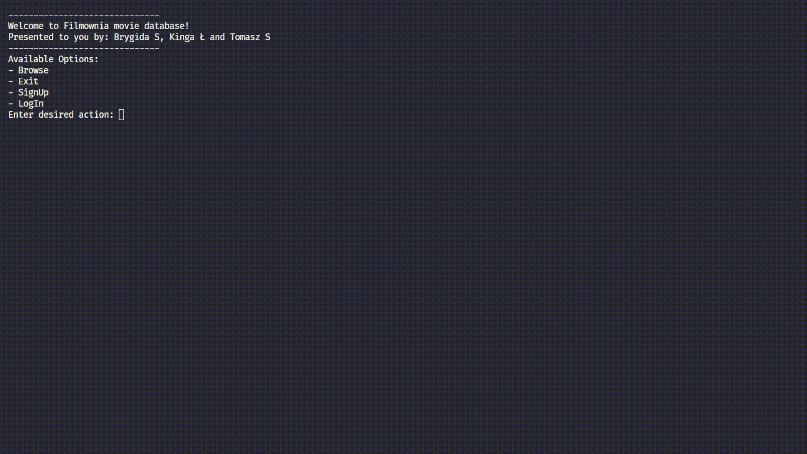

# Projekt PROI 2024L

## Skład zespołu

- Kinga Łukiewicz
- Brygida Silawko
- Tomasz Smoleń

## Temat Projektu
Nasz projekt to baza filmowa, która w zależności od roli użytkownika umożliwia mu dostęp z różnymi poziomami uprawnień. Użytkownik może wyszukiwać filmy, aktorów, reżyserów, producentów oraz scenarzystów. I w zależności od roli dodawać opinie o filmach oraz modyfikować bazę filmową przez dodanie lub usunięcie osób występujących w filmach.

## Używanie programu

### Budowanie programu
W katalogu projektu wywołaj:
```bash
cmake -S . -B build
cmake --build build --target main
```
### Uruchomienie programu

```bash
(cd build && ./main)
```

### Przykładowe użycia

1. Przeglądanie bazy z poziomu gościa

2. Dodawanie ocen jako zalogowany użytkowik

3. Edycja bazy z poziomu admina


## Testy jednostkowe

Należy zbudować wybrany test a następnie go uruchomić:
```bash
cmake --build build --target <wybrany test>
(cd build && ./<nazwa pliku wykonywalnego>)
```
np.
```bash
cmake --build build --target testPerson
(cd build && ./testPerson)
```
Dostępne testy:
- `testDate.cpp`
- `testFilm.cpp`
- `testPerson.cpp`
- `testUser.cpp`

## Klasy w programie

### Użytkownicy
#### User
Reprezentuje użytkownika bazy filmowej, zawiera informację o jego loginie oraz trzyma pointer na rolę jaką ma użytkownik (użytkownik zalogowany, gość lub admin). Posiada możliwość zalogowania (log_in) i wylogowania użytkownika (log_out).

#### Role
Reprezentuje rolę użytkownika bazy filmowej, zawiera informację o nazwie roli (guest, logged, admin), która ułatwia sprawdzanie jaką rolę pełni użytkownik oraz trzyma pointer na użytkownika. 

#### Guest
Reprezentuje gościa bazy filmowej, który może jedynie ją przeglądać. Klasa ta dziedziczy po klasie Role i dodatkowo posiada możliwość zarejestrowania użytkownika.

#### Logged
Reprezentuje zalogowanego użytkownika bazy danych, który dodatkowo może wystawić recenzję, usunąć ją oraz zobaczyć wszystkie swoje recenzje. Klasa ta dziedziczy po klasie Role i dodatkowo zawiera informację o recenzjach użytkownika.

#### Admin
Reprezentuje administratora bazy danych, który dodatkowo ma możliwość modyfikacji bazy filmowej. Klasa dziedziczy po klasie Role.

### Film i recenzje
#### Film
Klasa `Film` zawiera wszystko najważniejsze informacje, których chcielibyśmy się dowiedzieć o danej produkcji. Posiada możliwość "zrzucania się" do formatu kompatybilnego z naszymi plikami `.csv`, oraz konstruktor kompatybilny z tymże formatem.
Posiada też `getRating()`, które oblicza średnia ocene z recenzji, oraz `write()`, ktory w estetyczny sposób wyrzuca na strumień wyjściowy informacje o filmie.

#### Review
Klasa `Review` reprezentuje recenzję, ktora trzyma pointer na film, który opisuje. Tak jak film tez jest kompatybilna z plikami `.csv`. Oprócz tego też zawiera metode `write()`, do zrzucania informacji na strumień wyjściowy.

### Osoby

Klasa `Person` reprezentuje osobę i zawiera jej `id`, imię i nazwisko (`name`) oraz datę urodzenia (`birthDate`)
Po klasie `Person` dziedziczą:
- `Actor` - dodatkowy atrybut: `std::vector<Role> roles` - lista ról granych przez aktora, gdzie każda rola zawiera nazwę postaci i wskaźnik na film.
- `Director` - dodatkowy atrybut: `std::vector<Film *> films` - lista filmów wyreżyserowanych przez reżysera.
- `Producer` - dodatkowy atrybut: `std::vector<ProducerJob> jobs` - lista prac producenta, gdzie każda praca zawiera typ producenta i wskaźnik na film.
- `Writer` - dodatkowy atrybut: `std::vector<WriterJob> jobs` - lista prac scenarzysty, gdzie każda praca zawiera typ scenarzysty i wskaźnik na film.

Każda z osób ma metody na dodawanie lub usuwanie elementu z jej kolekcji, wyświetlanie informacji o niej oraz wyszukiwanie filmów, w których brała udział.

Klasy dziedziczące po `Person` są używane w celu wyświetlenia stron osób w głównym programie oraz łatwiejszej edycji bazy danych.

### Strony
#### Page
Wszystkie strony dziedziczą po klasie `Page`, która ma zdefiniowane wirtualne metody:
- `showOptions()` do drukowania możliwych opcji
- `print()` do drukowania informacji specyficznych dla każdej strony
- `nextAction()` do wybierania co chcemy zrobić dalej w programie
- `doAction()` który egzekwuje to co wybraliśmy w `nextAction()`

#### StartPage
Pozwala nam zalogować się albo się zarejestrować,  zobaczyć naszą stronę użytkownika (jeśli jesteśmy zalogowani) albo wejść do strony wyszkiwania.

#### UserPage
Wyświetla recenzje naszego użytkownika, pozwala je też usunąć.

#### BrowsePage
Pozwala na wyszukiwanie Filmów, albo osób (`Actor`, `Director`, `Producer`, `Writer`), i przy każdym wyszukiwaniu współpracuje z `DatabaseManager`

#### FilmPage
Przedstawia informacje o filmie, pozwala na przejscie do stron osób powiązanych z filmem, oraz dodanie recenzji jeśli jesteśmy zalogowani.

#### AddReviewPage
Służy do obsługi dodawania recenzji.

#### Actor/Producer/Writer/Director Page
Przedstawiają informacje o osobach, które reprezentują. Jeśli jesteśmy adminem dodatkowo pozwalają na dodanie roli/pracy albo jej usunięcie.


### Zarządzanie bazą danych
Klasa `DatabaseManager` zajmuje się działaniem na naszych plikach `.csv`. Najważniejsze metody to:
- `personSearch()`, która jest szablonem i wyszukuje dany typ osoby w odpowiedniej bazie danych
- `movieSearch()` które przeszukuje baze danych filmu
- `replaceLine()` która z wykorzystaniem pliku `temp.txt` edytuje wybraną bazę danych

## Inne uwagi do wykonanie projektu